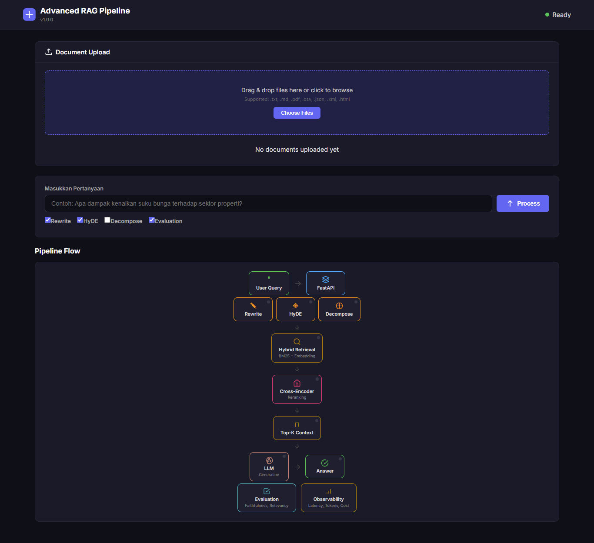

# Advanced RAG Pipeline System

Pipeline **Retrieval-Augmented Generation (RAG)** modular dengan query processing tingkat lanjut, hybrid retrieval, cross-encoder reranking, evaluasi otomatis, dan observability terintegrasi.

---

## Antarmuka Aplikasi

*Tampilan aplikasi RAG Pipeline*

---

## Arsitektur

`
User -> FastAPI -> Query Processing (Rewrite / HyDE / Decompose)
                  -> Hybrid Retrieval (BM25 + Dense Embedding)
                  -> Cross-Encoder Reranking
                  -> LLM Generation
                  -> Evaluation & Observability
`

## Fitur

- **Query Processing** - Rewrite, HyDE, Decompose untuk memperkaya query
- **Hybrid Retrieval** - BM25 (sparse) + Dense Embedding dengan Reciprocal Rank Fusion
- **Cross-Encoder Reranking** - Presisi tinggi dengan model reranker
- **Evaluation Module** - Faithfulness, Relevancy, Precision/Recall, MRR, nDCG
- **Observability** - Latency, token usage, cost tracking, logging terstruktur
- **Web Dashboard** - Visualisasi pipeline real-time dengan animasi tiap tahap
- **Document Upload** - Upload file .txt, .md, .pdf via drag & drop
- **Modular Design** - Setiap komponen dapat dikembangkan & di-scale independen

## Quick Start

### 1. Clone & Setup

`ash
git clone https://github.com/taufikaziz/rag-advanced.git
cd rag-advanced
python -m venv venv
source venv/bin/activate   # Linux/Mac
.\\venv\\Scripts\\Activate  # Windows
`

### 2. Install Dependencies

`ash
pip install -r requirements.txt
# Untuk upload PDF:
pip install PyPDF2 pdfminer.six pdfplumber
`

### 3. Konfigurasi

`ash
cp .env.example .env
# Edit .env dengan API key Groq/OpenAI
`

### 4. Upload Dokumen

Upload file melalui web dashboard atau via API.

### 5. Jalankan Server

`ash
uvicorn app.main:app --reload --host 0.0.0.0 --port 8000
`

Buka **http://localhost:8000** untuk web dashboard.

## API Endpoints

| Method | Path | Deskripsi |
|--------|------|-----------|
| GET | / | Redirect ke web dashboard |
| POST | /api/v1/query | Query utama RAG pipeline |
| POST | /api/v1/documents/upload | Upload dokumen (JSON base64) |
| GET | /api/v1/documents | Lihat daftar dokumen |
| DELETE | /api/v1/documents/{id} | Hapus dokumen |
| GET | /api/v1/health | Health check |
| GET | /api/v1/metrics | Metrik operasional |

### Contoh Query

`ash
curl -X POST http://localhost:8000/api/v1/query \\
  -H "Content-Type: application/json" \\
  -d '{"query": "Apa dampak kenaikan suku bunga?", "top_k": 5}'
`

## Struktur Proyek

`
rag-advanced/
+-- app/
|   +-- main.py                   # FastAPI entry point
|   +-- config.py                 # Konfigurasi environment-based
|   +-- api/
|   |   +-- routes.py             # API endpoints
|   |   +-- schemas.py            # Pydantic schemas
|   +-- core/
|   |   +-- pipeline.py           # Pipeline orchestrator
|   |   +-- ingestion/            # Document parser & chunker
|   |   +-- query_processing/     # Rewrite, HyDE, Decompose
|   |   +-- retrieval/            # BM25, Dense, Hybrid
|   |   +-- reranking/            # Cross-encoder reranker
|   |   +-- generation/           # LLM abstraction
|   +-- evaluation/               # RAG evaluator & metrics
|   +-- observability/            # Logging, metrics, tracing
|   +-- static/                   # Web dashboard (HTML/CSS/JS)
+-- tests/
|   +-- test_pipeline.py          # Unit tests
+-- .env.example
+-- requirements.txt
+-- README.md
`

## Fase Pengembangan (PRD)

| Fase | Cakupan | Status |
|------|---------|--------|
| Fase 1 | FastAPI skeleton + Hybrid Retrieval + LLM Generation | ✅ |
| Fase 2 | Query Processing + Cross-Encoder Reranking | ✅ |
| Fase 3 | Evaluation Module | ✅ |
| Fase 4 | Observability | ✅ |
| Fase 5 | Hardening, Testing, Dokumentasi | 📝 |
